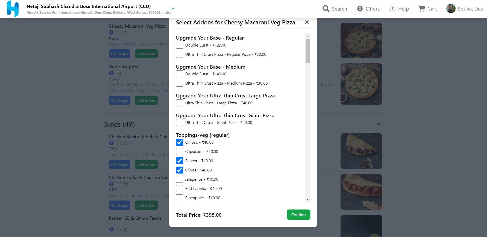

# HungryBaaz
*Delivering your favorite food with a smile.*
***

**HungryBaaz** is a modern web application designed to offer a seamless and engaging dining experience. With advanced features ranging from recipe generation to real-time data fetching and user-friendly design elements, HungryBaaz is tailored for desktop and tablet users seeking a dynamic restaurant menu experience.

## Overview

HungryBaaz integrates various advanced features to enhance user interaction with restaurant menus. This application includes:

- **Recipe Generation**: Generate recipes on-demand.
- **User Authentication**: Secure login and registration with Google integration.
- **Real-Time Data Fetching**: Up-to-date menu information from Swiggy.
- **Responsive Design**: Optimized for desktop and tablets.

## Features

### 1. Impressive Design

- **Feature**: Modern, visually appealing design to enhance user experience.
- **Screenshot**:

  
  *The clean and elegant design of HungryBaaz.*

### 2. User Authentication

- **Feature**: Secure login and registration system with Google integration.
- **Details**: After logging in with Google, the user's profile image replaces the default user icon. Clicking the icon opens a logout option.
- **Screenshot**:

  
  *Google login and manual login also user can create account by clicking the register and fill the register form for further login.*

  
  *Google login and user profile image integration.*

### 3. Location Change and Recent Searches

- **Feature**: Change location across India and view recent searches in the sidebar.
- **How to Access**: Click on the location change option in the header to open the sidebar, which shows recent searches (up to 3).
- **Screenshot**:

  
  
  *Change location and view recent searches.*

### 4. Cuisine

- **Feature**: Discover and explore various cuisines available in the menu.
- **Details**: View different types of cuisine and their respective dishes.
- **Screenshot**:

  
  *Explore diverse cuisines available in the menu.*

### 5. Search and Filter Functionality

- **Feature**: Search and filter menu items based on important criteria.
- **How to Access**: Use the search bar and filter options on the menu page.
- **Screenshot**:

  
  
  *Search and filter options for a tailored menu experience.*

### 6. Real-Time Data Fetching

- **Feature**: Fetch real-time data from the Swiggy API to provide up-to-date menu information.
- **How to Access**: Data is automatically updated in the menu interface.
- **Screenshot**:

  
  *Live updates from Swiggy API.*

### 7. Add-ons and Cart Functionality

- **Feature**: Add or remove add-ons for menu items, manage cart items, and enforce checkout requirements.
- **Details**: Users can only proceed to checkout if logged in and have added an address. items in the cart can be removed.
- **Screenshot**:

  
  
  *Manage add-ons and cart items efficiently.*

### 8. Responsive Design

- **Feature**: Fully responsive design for desktop and tablets.
- **Note**: The design is optimized for desktop and tablet devices; mobile screen support is limited due to API constraints.
- **Screenshot**:
  
  *Responsive design for desktop.*

  
  *Responsive design for tablets.*


## Installation

To set up HungryBaaz locally, follow these steps:

1. **Clone the repository:**

   ```bash
   git clone https://github.com/souvik-coder24/HungryBaaz.git

2. **Install dependencies:**
   ```bash
   npm install

3. **Start the development server:**
   ```bash
   npm run dev

4. **Build the project for production (optional):**
   ```bash
   cd HungryBaaz

5. **Preview the production build (optional):**
   ```bash
   npm run preview

## Contributing

We welcome contributions to HungryBaaz. To contribute:

1. **Fork the repository on GitHub.**

2. **Create a new branch:**
   ```bash
   git checkout -b feature/your-feature-name

3. **Stages all changes for the next commit:**
   ```bash
   git Add

4. **Commits the staged changes with a message describing the changes:**
   ```bash
   git commit -m "Add your feature or fix description"

5. **Pushes the committed changes to a specific branch in the remote repository:**
   ```bash
   git push origin feature/your-feature-name

6. **Open a pull request on GitHub with a detailed description of your changes.**


## Problems Faced
### Limited Mobile Support

- **Issue**: The application is primarily optimized for desktop and tablet devices, with limited support for mobile screens due to API constraints.
- **Solution**: Focused development on desktop and tablet views, considering mobile support as a future enhancement.

### Real-Time Data Integration

- **Issue**: Ensuring real-time data fetching and integration from the Swiggy API was challenging. The actual API endpoints were not publicly available, necessitating the use of a proxy for data fetching.
- **Solution**: Implemented a proxy to facilitate data fetching. Focused on optimizing API calls and handling responses efficiently.

### User Authentication Handling

- **Issue**: Managing user authentication with Google and email/password required careful handling of authentication states.
- **Solution**: Utilized Firebase authentication services and Redux for state management to ensure a smooth user experience.

### Multiple API Integration

- **Issue**: Integrating with multiple APIs posed a significant challenge as finding the correct API endpoints took a lot of time due to their non-public availability.
- **Solution**: Invested significant time in researching and testing various APIs to identify the correct ones, utilizing proxies where necessary to bridge gaps.

## Future Plans

### Mobile Support

- **Plan**: Expand support to mobile screens, ensuring a responsive design that works seamlessly across all device sizes.

### Payment Integration

- **Plan**: Integrate payment processing with Razorpay to facilitate secure and efficient transactions.

### Chat Bot

- **Plan**: Add a chat bot to assist users with their queries and provide real-time support.

### Live Location Tracking

- **Plan**: Implement functionality to track and display the user's live location for a more personalized experience.

### Enhanced Design

- **Plan**: Continue to improve the visual design of the application, aiming for a more beautiful and intuitive user interface.

### Food Making Process Visualization

- **Plan**: Add a feature to show the food-making process with a progress bar and animations. While animations are not implemented yet, future plans include using GSAP for enhanced visual effects.


